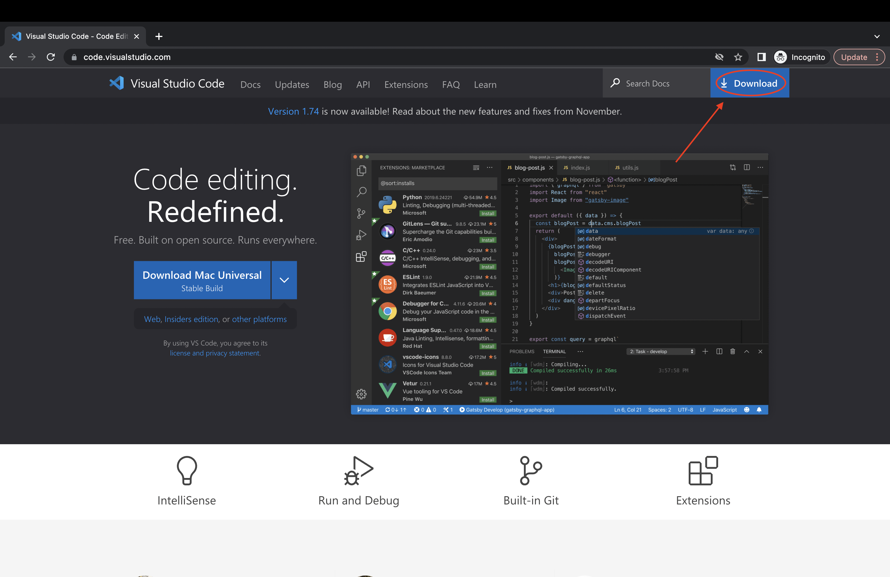
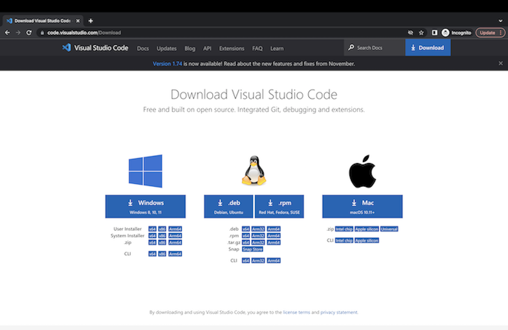
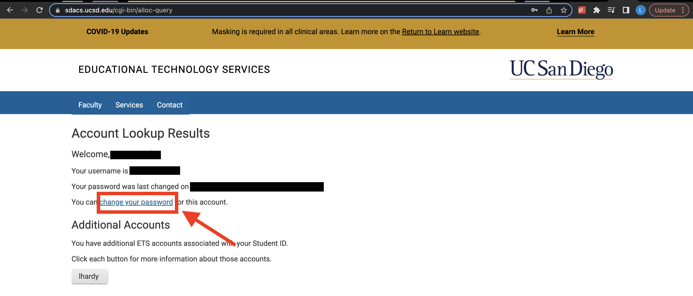
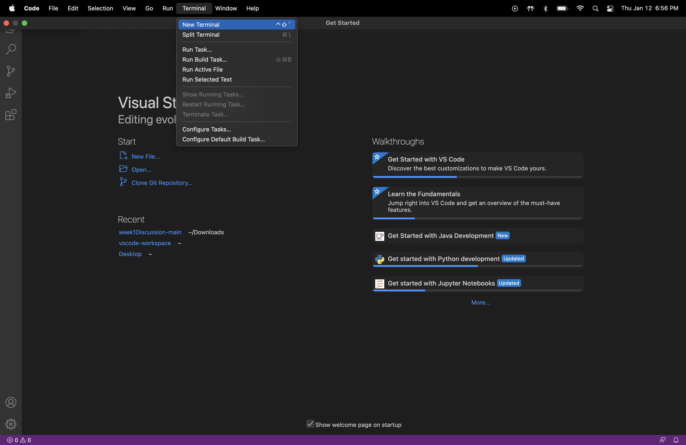
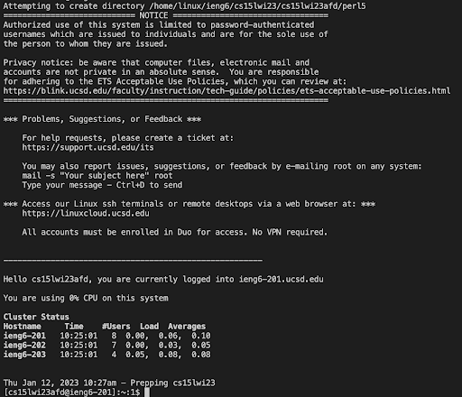
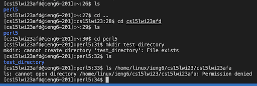

# Week 1 Lab Report
Liam Hardy
CSE 15L

## How to Install Visual Studio Code

1. Click this [link](https://code.visualstudio.com/) to navigate to the VS code website and click the download button as shown below 

3. Select the version that matches your machine's specificities

## How to log in to your course specific ieng6 account and remotely connect to a server in the CSE Basement
1. If you know your ieng6 account information, skip to step 2. If not, click  link and enter your ucsd username and student ID, or if you do not remember your ucsd username, you can use your last name in combination with your student ID to look up your account. Click submit and either way you should end up on a page where you can click the change password button shown below (you may have to click your account name as an intermediate step if you have multiple):  
. 
Now, enter your old password, and your new password as it prompts, then instead of clicking the blue "check password" button, just press enter.
`1. If you do not know your ieng6 account information, follow [these](https://docs.google.com/document/d/1hs7CyQeh-MdUfM9uv99i8tqfneos6Y8bDU0uhn1wqho/edit) instructions. After that,`  
2. Open Visual Studio Code and open a terminal window as shown below or with the shortcut Ctrl + \` for Windows or Command + \` for Mac.

3. In order to remotely connect to a server, we will use `ssh`. Type `ssh <insertUsername>@ieng6.ucsd.edu`, where `<insertUsername>` is replaced with your username for your ieng6 account. If this server is new to your machine, you will be told that the host's authenticity has not been verified. In order to verify, type `yes` and press enter. You will then be prompted for a password. Enter the password for your ieng6 account and now you are connected to the server. The process after completion is shown below, you should see something like this:  

## How to test some commands while logged on remotely
1. Once remotely connected you can test commands by executing them in the same terminal window you used to connect to the server. Now you may type whatever commands you wish, some of the most basic being
- cd
- cd ~
- ls
- ls lat
- mkdir
- pwd
- cat
An example of using some basic commands can be shown below:  

  

In this example, I used `ls` to list the current files/directories in the current working directory, then used `cd` to ender the `perl5` directory that was within my user directory. Then I used `mkdir` in order to make a directory called `test_directory`, although because I had already done that earlier, it gave me the error message that the file already exists.
I then used `ls` to list the files in the current working directory again, and then attempted to list the files in a directory created by another user, which I was denied access too because I am not logged in as that user

