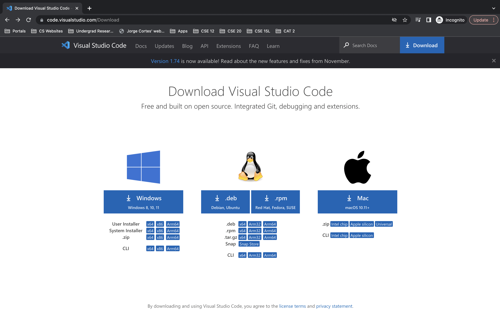

# Week 1 Lab Report
Liam Hardy
CSE 15L

## How to Install Visual Studio Code

1. Click this [link](https://code.visualstudio.com/) to navigate to the VS code website and click the download link shown below 

3. Select the version that matches your machine's specificities, be sure to account for the 

## How to log in to your course specific ieng6 account and remotely connect to a server

1. If you do not know your ieng6 account information, follow [these](https://docs.google.com/document/d/1hs7CyQeh-MdUfM9uv99i8tqfneos6Y8bDU0uhn1wqho/edit) instructions. After that, open Visual Studio Code and open a terminal window as shown below.

2. In order to remotely connect to a server, we will use
'ssh'
. type 'ssh <insertUserName>@ieng6.ucsd.edu'
  , where '<insertUserName>'
  is replaced with your username for your ieng6 account.

## How to test some commands while logged on remotely
