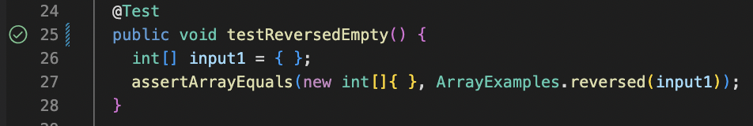
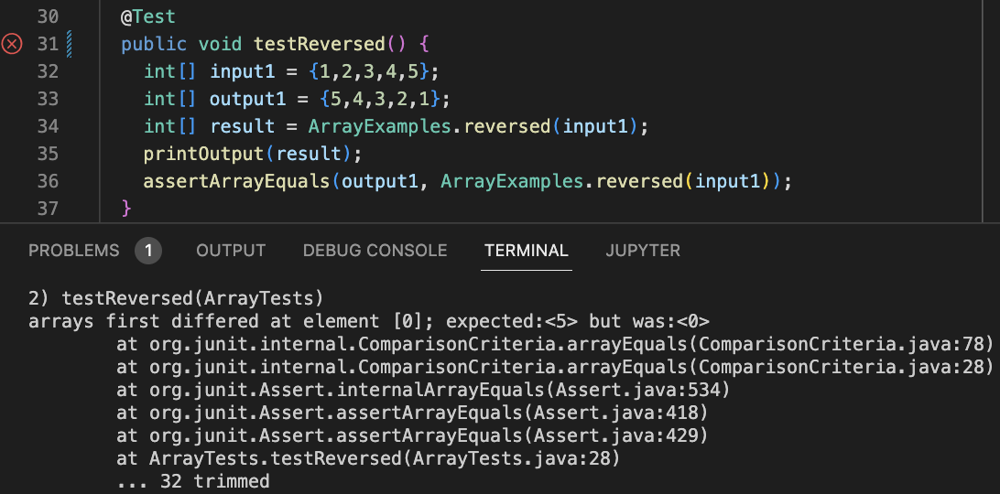
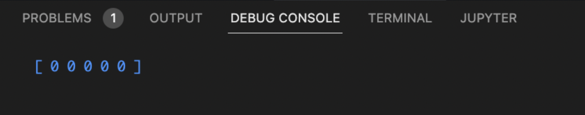
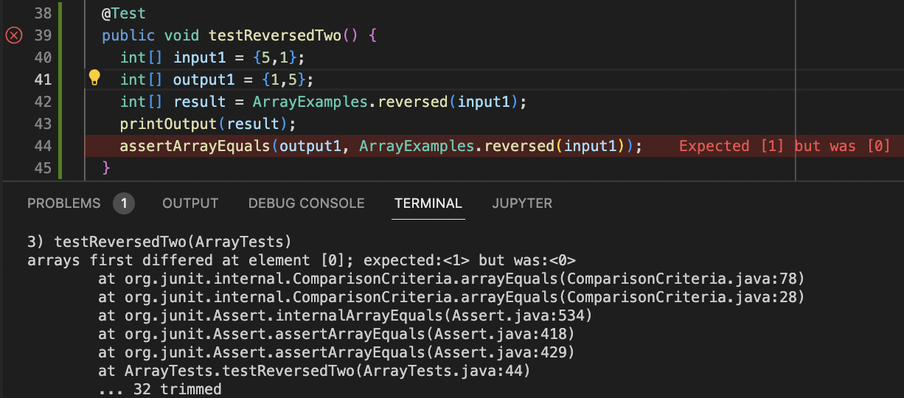
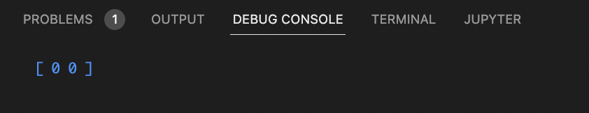

# Lab Report 2
Liam Hardy
CSE 15L


# The StringServer `/add-message` path
## Part 1
**Code for my implementation of the server and URL handler**
```
class Handler implements URLHandler {
   
    String finalOutput = "";

    public String handleRequest(URI url) {
        if (url.getPath().equals("/")) {
            return finalOutput;
        } 
        else {
            if (url.getPath().contains("/add-message")) {
                    String[] parameters = url.getQuery().split("=");
                if (parameters[0].equals("s")) {
                    for (int i = 1; i < parameters.length; i++) {
                        finalOutput = finalOutput + parameters[i] + "\n";
                    }
                    return finalOutput;
                }
            }
            return "404 Not Found!";
        }
    }
}

public class VerticalStringList {
    public static void main(String[] args) throws IOException {
       
        if(args.length == 0){
            System.out.println("Missing port number! Try any number between 1024 to 49151");
            return;
        }

        int port = Integer.parseInt(args[0]);

        Server.start(port, new Handler()); 
    }
}
```
  
  
  
  
**Server after one String has been added**  


When this path is given, the `handleRequest()` method is called. 
The relevant value for this method is of course the `URI url` argument that is passed into the method.
An important part of `url` is if it contains a path, specifically that path being `/add-message` or not, as well as
if the url containts a query, and whether the query's first parameter is "s".
In this case, the path is `/add-message` and the query is `s=Hello%20world!`, which is equivalent to `s=Hello world!`.
Because of these values, the `finalOutput` String is modified to include a newline character (`\n`) 
and the String that is passed in in the query after the `=`, which is `Hello world!`. The value of `finalOutput` changed
from `""` to `"Hello world!\n"`.
  
  
  
  

**Server after two Strings have been added**

This path is the same path as the previous screenshot, so the `handleRequest()` method is called.
The `URI url` argument is once again the relevant value for this method, and in this case, the path is still `add-message` and
the query is now `s=Oh%20hi%20there!`, equivalent to `s=Oh hi there!`.
Because of these values, the `finalOutput` String goes from being `"Hello world!\n"` to being `"Hello world!\nOh hi there!"`.
## Part 2
  
The bug that I am choosing from lab 3 lies in the `reversed(int[] array)` method in the `ArrayExample.java` file. Which is shown below. 
```
// This is the method being tested.
// Returns a *new* array with all the elements of the input array in reversed
// order
  static int[] reversed(int[] arr) {
    int[] newArray = new int[arr.length];
    for(int i = 0; i < arr.length; i += 1) {
      arr[i] = newArray[arr.length - i - 1];
    }
    return arr;
  }
```
A failure inducing input of {1,2,3,4,5} is shown in the tester below:
```
@Test
  public void testReversed() {
    int[] input1 = {1,2,3,4,5};
    int[] output1 = {5,4,3,2,1};
    int[] result = ArrayExamples.reversed(input1);
    printOutput(result);
    assertArrayEquals(output1, ArrayExamples.reversed(input1));
  }
```
This input (an empty array) does not induce failure:
```
@Test
  public void testReversedEmpty() {
    int[] input1 = { };
    assertArrayEquals(new int[]{ }, ArrayExamples.reversed(input1));
  }
```
The the `testReversedEmpty()` passes, as shown below:  
  
  
## Failing test #1  
The symptom of the `testReversed()` tester is that the resulting list is full of 0s, or {0, 0, 0, 0, 0}. The test failing is shown below:
  
  
The debug console shows this as the actual output of `ArrayExamples.reversed(input1)`:
  
     
## Failing test #2  
Another test that induces failure is shown below, with the same symptom as the test above.
  
  
The debug console yet again shows a list full of zeros as the actual output of `ArrayExamples.reversed(input1)`:
  
  
  
## What is the bug?
The code with the bug is shown here:
```
  static int[] reversed(int[] arr) {
    int[] newArray = new int[arr.length];
    for(int i = 0; i < arr.length; i += 1) {
      arr[i] = newArray[arr.length - i - 1];
    }
    return arr;
  }
```
After fixing the bug, the code looks like this:
```
  static int[] reversed(int[] arr) {
    int[] newArray = new int[arr.length];
    for(int i = 0; i < arr.length; i += 1) {
      newArray[i] = arr[arr.length - i - 1];
    }
    return newArray;
  }
```
Two lines needed to be changed. One was the 4th line, where the item in newArray should have been assigned to the item in arr, rather than
the other way around as it was previously. The second was the 6th line, where the new array `newArray` should have been returned rather than `arr`.  
  
This change fixed the bug, as previously, `newArray` was initialized to an empty array, `arr` was then set to a reversed deep copy of `newArray`, and returned, resulting in a reversed 'empty array' always being returned, or an array where every element is 0. This change makes it so that instead of assigning a reversed deep copy of `newArray` to `arr`, a deep copy of `arr` is reversed and assigned to `newArray`, which then, because of the chagne on line 6, is returned.  
  
## Part 3  
  
In the lab for week 2, I learned how to write my own server to host a url on and use URLHandler to describe the server's behavior based on the path and the query. I learned what each section of the link means, with / indicating path and ? marking the query. Specifically I learned and practiced using methods from the URI class such as getQuery() and getPath() to make a server that has whatever behavior I want.

