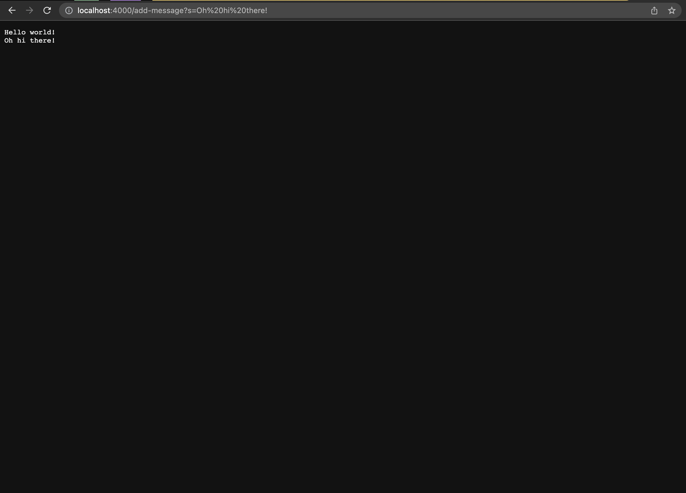

# Lab Report 2
Liam Hardy
CSE 15L

# The StringServer `/add-message` path
`
class Handler implements URLHandler {
   
    String finalOutput = "";

    public String handleRequest(URI url) {
        if (url.getPath().equals("/")) {
            return finalOutput;
        } 
        else {
            if (url.getPath().contains("/add-message")) {
                    String[] parameters = url.getQuery().split("=");
                if (parameters[0].equals("s")) {
                    for (int i = 1; i < parameters.length; i++) {
                        finalOutput = finalOutput + parameters[i] + "\n";
                    }
                    return finalOutput;
                }
            }
            return "404 Not Found!";
        }
    }
}

public class VerticalStringList {
    public static void main(String[] args) throws IOException {
       
        if(args.length == 0){
            System.out.println("Missing port number! Try any number between 1024 to 49151");
            return;
        }

        int port = Integer.parseInt(args[0]);

        Server.start(port, new Handler()); 
    }
}
`

When this path is given, the `handlRequest()` method is called. 
The relevant values for this method is of course the `URI url` argument that is passed into the method.
An important part of `url` is if it contains a path, specifically that path being `/add-message` or not, as well as
if the url containts a query, and whether the query's first parameter is "s".

