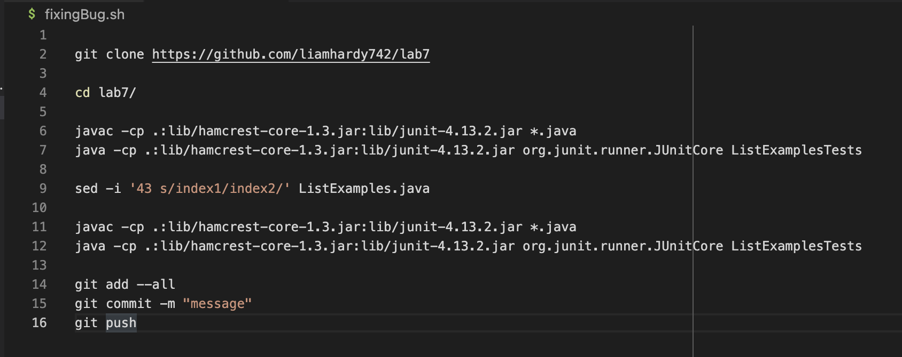
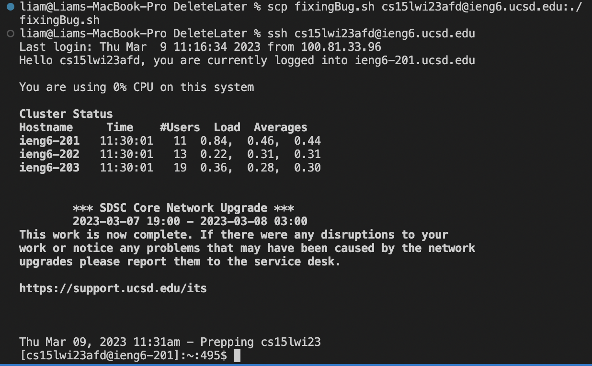

## For this lab report I will be making a bash script in order to complete the task for lab 7 as fast as possible.

Because a bash script runs all of the commands on the machine in which the bash script was executed, it wasn't simple to include the ssh command in the bash script, so instead, I used scp to copy the bash script onto the ieng6 machine, and then ssh-ed into the machine, and then ran the bash script.

The bash script that completes the task for lab 7 is shown below:

After deleting my fork of the repository and reforking the lab7 repository, the first step was to scp the bash script onto the ieng6 machine, and then ssh onto it, which is shown below.

Then, I could simply run `bash fixingBug.sh` to run the bash script and complete the task. The results are shown below:

